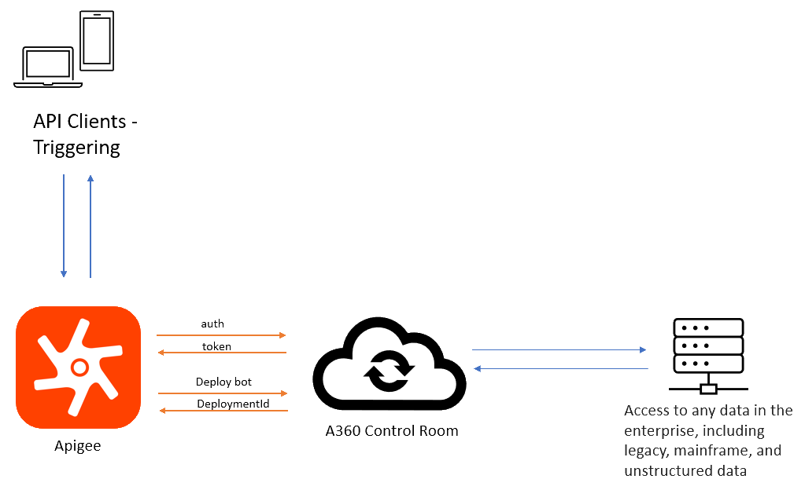

# Automation Anywhere and Apigee Integration

Integrate Apigee with the Control Room API platform. Authenticate yourself to access a Control Room and deploy bots by using various Control Room APIs.

The Apigee integration studio allows you to build integrations to connect with enterprise applications, databases, and event-driven systems using the features provided, such as connectors, integration engine, and data transformation tools. Automation 360 employs software bots that enable several industries to automate their repetitive business processes. Apigee will help you to create a custom integration to deploy the bots created using the Automation 360 platform. The following diagram shows the various components involved in the intergration of with Automation 360 with Apigee.

**Note:** Two prebuilt integrations are available to build the integration. For more information about prebuilt integrations, see [Prebuilt integrations](integration-json-files.md). Deploy the prebuilt integration by configuring your Automation 360 Control Room and bot parameters.

The prebuilt integrations simplify access to Automation 360 bots by abstracting the underlying API integration between Automation 360 Control Room APIs and Apigee Integration Service.

[Creating the main integration \(TriggerA360Bot.json\)](creating-main-integration.md) and [Creating a subintegration \(LaunchA360Bot.json\)](creating-sub-integration.md) are optional sections that explain the underlying integrations that are downloaded from [Prebuilt integrations](integration-json-files.md). The first integration \([Creating the main integration \(TriggerA360Bot.json\)](creating-main-integration.md)\) is mainly used to set up all the parameters, and these parameters will be passed on to the second integration \([Creating a subintegration \(LaunchA360Bot.json\)](creating-sub-integration.md)\).

**Note:** By dividing the integration, you can reuse the second integration by calling it with a different set of input parameters.

-   **[Prebuilt integrations](../A360-Apigee-Integration/integration-json-files.md)**  
The Automation 360 and Apigee integration has two prebuilt Apigee integrations in the form of JSON file models, the `TriggerA360Bot.json` file and the `LaunchA360Bot.json` file. Download these two integration files, upload them as new integrations in your Apigee instance, and start calling Automation 360 bots. Download the `TriggerA360Bot.json` and `LaunchA360Bot.json` files from the following location: [https://github.com/AutomationAnywhere/Apigee-Integration/tree/main/apigee-integrations](https://github.com/AutomationAnywhere/Apigee-Integration/tree/main/apigee-integrations)
-   **[Getting bot input parameters](../A360-Apigee-Integration/getting-bot-input-parameters.md)**  
Get the input parameters from an Automation 360 bot that are required for launching the integration \([Creating the main integration \(TriggerA360Bot.json\)](creating-main-integration.md)\).
-   **[Creating the main integration \(TriggerA360Bot.json\)](../A360-Apigee-Integration/creating-main-integration.md)**  
The main integration task calls the subintegration by using the trigger ID.
-   **[Creating a subintegration \(LaunchA360Bot.json\)](../A360-Apigee-Integration/creating-sub-integration.md)**  
As you build a subintegration, ensure that the bot that you are trying to deploy is already available in the Control Room.

**Parent topic:**[Integrations](../../enterprise/topics/aae-client/bot-creator/customizing-an-automation-client/integrations.md)

