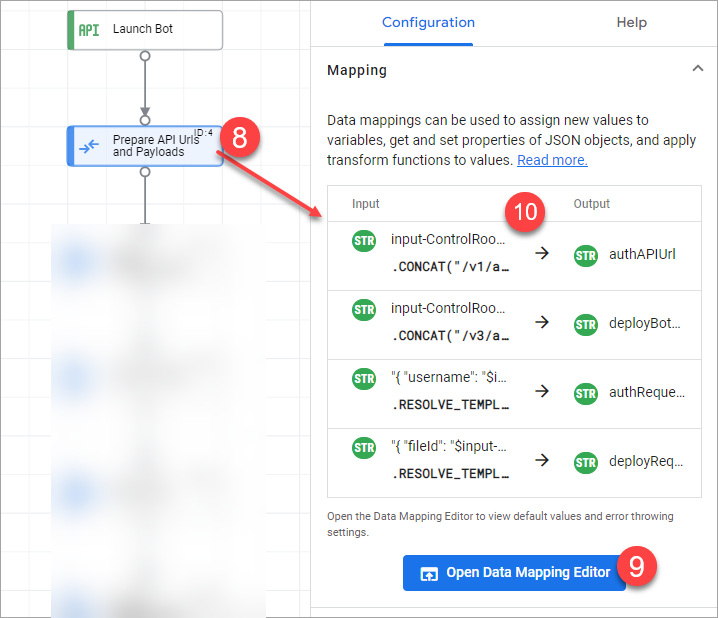
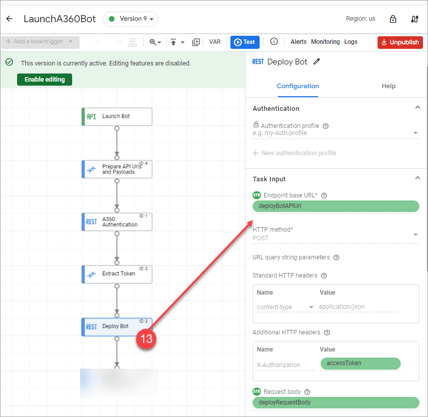

# Building the Integration

This section provides a step by step process to build the integration. Make sure that the bot you are trying to deploy is already available in the Control room.

To build a new integration perform the following steps:

1.  Go to the [Apigee UI](https://apigee.google.com/landing) and sign in.
2.  Select your organization using the drop-down menu in the upper left corner of the UI.
3.  Click **Develop** \> **Integrations** to view the list of available integrations.
4.  Select an existing integration or click **CREATE NEW**.
5.  Input the following:
    -   *Integration name*: Enter a name, e.g.lauchbot
    -   \(Optional\)*Description*: Provide a description, e.g. Deploys an A360 bot for processing files
    -   *Region*: Select a region from the list, e.g. US
6.  Click **Create** button.

    Integration Editor appears.

7.  In the Integration Editor, add a Trigger to the designer, by
    -   Clicking **+ Add a task/trigger**
    -   Select **Triggers** \>\> **API Trigger**
    -   Place the trigger on the canvas by clicking on an appropriate location.

        The Trigger ID is auto-generated based on the integration name.

        The **API trigger** allows integration authors to test an integration via an API call. This trigger is useful when you want to test your integration from your application code.

        

8.  In the Integration Editor, add a **Data Mapping** task to the designer, by
    -   Clicking **+ Add a task/trigger**
    -   Select **Tasks** \>\> **Data Mapping**
    -   Place the Data Mapping on the designer by clicking on an appropriate location.
9.  Click the **Data Mapping** element on the designer to open the **Data Mapping** configuration pane.

    The **Data Mapping** task lets you perform variable assignments in your integration. The variables can be integration variables or task variables. The **Data Mapping** task allows integration authors to transform and assign data to variables between tasks in an integration. Mappings need not be to other variables; it is OK to transform a variable and map it back to itself. Variables are created using the VAR option in the palette.

    

10. Create the following input and output variables as listed below. The input variable are the variables passed to integration runners. You can specify a literal value or select a reference variable. To add an Input variable to the data mapping, click and drag a variable from the list of available variables in the adjacent **Variables** column. Click **Add +** to configure a new variable.

    For this sample, create seven input variables\(string datatype\) as inputs for the integration:

    -   *input-ControlRoomUrl*
    -   *input-Username*
    -   *input-ApiKey*
    -   *input-BotId*
    -   *input-RunAsUserId*
    -   *input-PoolId*
    -   *input-BotInputVariables*
    Create one output variable as the output of the integration:

    -   *output-deploymentId*
    A few local variables that exist only within the scope of this integration: *accessToken*, *authAPIUrl*, *deployBotAPIUrl*, *authRequestBody*, and *deployRequestBody*. In addition to these, Apigee auto generates a few local variables for data parking and transformation purposes.

    After the variables are created, close the data mapping editor.

11. In the integration designer, add an element to make a call to A360 control room **authentication API**, by
    -   Clicking **+ Add a task/trigger**
    -   Select **Tasks** \>\> **Call Rest Endpoint**
    -   Place the Data Mapping on the designer by clicking on an appropriate location to view the **Call REST Endpoint** task configuration pane.
    -   Map the following fields with the variables defined in the previous step.
        -   Map the **Endpoint base URL** field to the variable *authAPIUrl*
        -   Map the **Request body** field to the variable *authRequestBody*

            

12. Add a Data Mapping task to the designer to extract the token from the previous step. Perform JSON to string operations as shown and save it to a variable.

    

13. Make the call to A360 control room **bot deploy API**

    Add a new task **Call Rest Endpoint** to the canvas and configure the endpoint URL and http POST method on the right-hand pane. Also update the request body with the correct credential.

    

14. Add a Data Mapping task to extract the bot deployment ID from the previous step. Extract the deployment ID, and save it to a variable.

    The integration looks like this:

    

**Parent topic:**[Automation Anywhere and Apigee Integration](../../../topics/nirmal/A360-Apigee-Integration/a360-apigee-integration.md)

