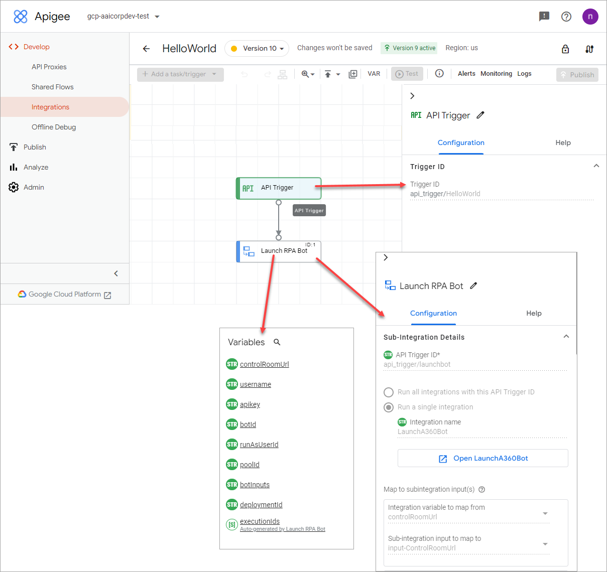

# Configuring the Call Integration task

The **Call Integration** task lets you run other integrations \(sub-integrations\) from your main integration. It is built to launch the main integration by passing all the parameters.

This task uses the API **Trigger ID** as a handle to identify the integrations to run. For example, if you specify the API **Trigger ID** as `api_trigger/launchbot`, the task runs all the sub-integrations that have the `api_trigger/lauchbot` trigger ID. After running a sub-integration, you can also read the response of the sub-integration in your main integration. Use this task to run sub-integrations as dependencies of the main integration. To Configure the Call Integration task, do the following:

1.  Go to the [Apigee UI](https://apigee.google.com/landing) and sign in.
2.  Select your organization using the drop-down menu in the upper left corner of the UI.
3.  Click **Develop** \> **Integrations** to view the list of available integrations.
4.  Click **CREATE NEW**.
5.  Input the following:
    -   *Integration name*: Provide a name of the integration from the [Building the Integration](building-integration.md).
    -   \(Optional\)*Description*: Provide a description, e.g. Deploys an A360 bot.
    -   *Region*: Select a region from the list, e.g. US
6.  Select **Add a task/trigger \> Tasks** to display a list of available tasks.
7.  Drag the **Call Integration** element to the integration designer.
8.  Click the **Call Integration** task element on the designer to view the **Call Integration** task configuration pane.

    

9.  Configure the remaining fields and define the variables\(string datatype\) for the integration. For more information on getting all the input parameters, see [Getting Bot Input Parameters](getting-bot-input-parameters.md).
    -   *input-ControlRoomUrl*
    -   *input-Username*
    -   *input-ApiKey*
    -   *input-BotId*
    -   *input-RunAsUserId*
    -   *input-PoolId*
    -   *input-BotInputVariables*

        This task is useful when you have a dependency on another integration and want to run it from your main integration. The task runs the sub-integration either synchronously or asynchronously.

**Parent topic:**[Automation Anywhere and Apigee Integration](../../../topics/nirmal/A360-Apigee-Integration/a360-apigee-integration.md)

