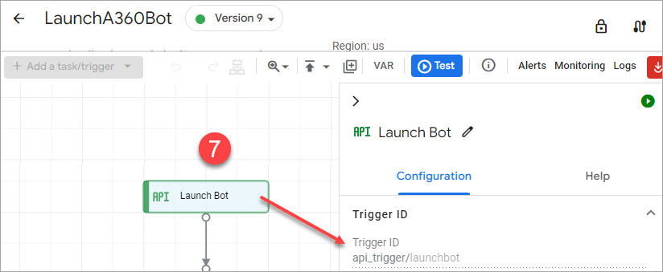
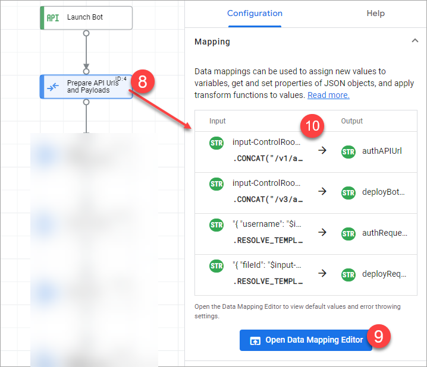
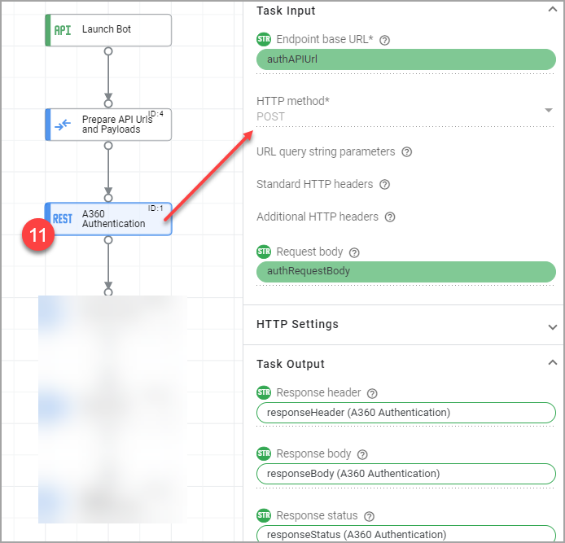
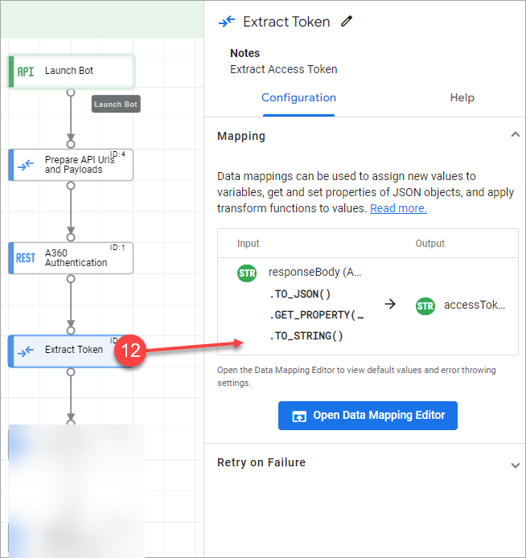
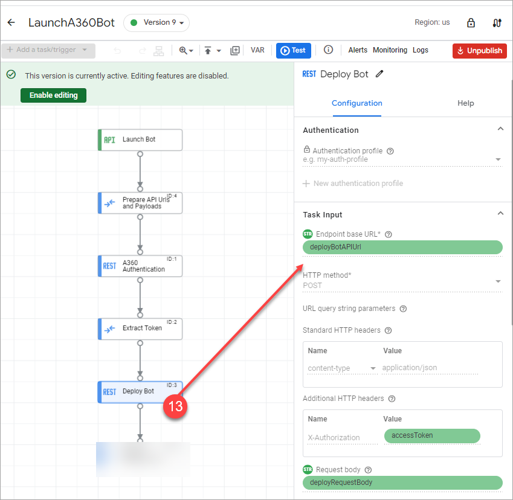
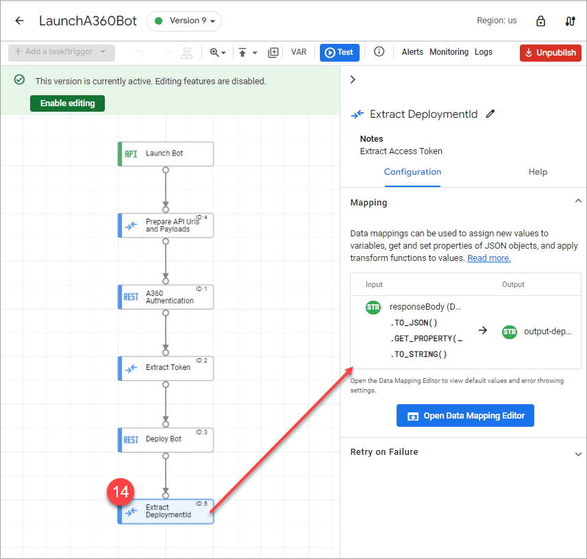

# Creating a subintegration \(`LaunchA360Bot.json`\)

As you build a subintegration, ensure that the bot that you are trying to deploy is already available in the Control Room.

Perform the following steps to build a subintegration:

1.  Go to [Apigee UI](https://apigee.google.com/landing) and sign in.
2.  Select your organization using the drop-down menu in the top-left corner of the UI.
3.  To view a list of available integrations, click **Develop** \> **Integrations**.
4.  Select an existing integration or click **CREATE NEW**.
5.  Provide the following information:
    -   **Integration name**: Enter a name, for example, *launch-bot*.
    -   *\(Optional\)***Description**: Provide a description, for example, "Deploys an Automation 360 bot for processing files.
    -   **Region**: Select a region from the list, for example, US.
6.  Click **Create**.

    The **Integration Editor** appears.

7.  In the **Integration Editor**, add a trigger to the designer by performing the following actions:
    -   Click **+ Add a task/trigger**.
    -   Select **Triggers** \> **API Trigger**
    -   Place the trigger on the designer by clicking in an appropriate location.

        The trigger ID is generated automatically based on the integration name. The API trigger allows integration authors to test an integration through an API call. This trigger is useful when you want to test your integration from your application code.

        

8.  In the **Integration Editor**, add a **Data Mapping** task to the designer by performing the following actions:
    -   Click **+ Add a task/trigger**.
    -   Select **Tasks** \> **Data Mapping**.
    -   Place the data mapping on the designer by clicking in an appropriate location.
9.  Click the **Data Mapping** element on the designer to open the **Data Mapping** configuration pane.
10. Click **Open Data Mapping Editor**.

    The **Data Mapping Editor** lets you to perform variable assignments in your integration. The variables can be integration variables or task variables. The **Data Mapping** task allows integration authors to transform and assign data to variables between tasks in an integration. Variables are created using the VAR option in the palette.

    

11. Create input and output variables based on the following list. Input variables are variables passed to integration runners. Specify a literal value or select a reference variable. To add an input variable to the data mapping, click and drag a variable from the list of available variables in the adjacent **Variables** column. Click **Add +** to configure a new variable.

    For this sample, create seven input variables of string datatype as inputs for the integration:

    -   *input-ControlRoomUrl*
    -   *input-Username*
    -   *input-ApiKey*
    -   *input-BotId*
    -   *input-RunAsUserId*
    -   *input-PoolId*
    -   *input-BotInputVariables*
    Create one output variable as the output of the integration:

    -   *output-deploymentId*
    A few local variables that exist only within the scope of this integration are as follows: *accessToken*, *authAPIUrl*, *deployBotAPIUrl*, *authRequestBody*, and *deployRequestBody*. In addition to these, Apigee autogenerates a few local variables for data parking and transformation purposes.

    After the variables are created, close the data mapping editor.

12. In the integration designer, add an element to make a call to the Automation 360 Control Room authentication API by performing the following actions:
    -   Click **+ Add a task/trigger**.
    -   Select **Tasks** \> **Call Rest Endpoint**
    -   Place the data mapping on the designer by clicking in an appropriate location to view the **Call REST Endpoint** task configuration pane.
    -   Map the following fields with the variables defined in the previous step.
        -   Map the **Endpoint base URL** field to the *authAPIUrl* variable.
        -   Map the **Request body** field to the *authRequestBody* variable.

            

13. Add a data mapping task to the designer to extract the token from the previous step. Perform JSON to string operations as shown and save it to a variable.

    

14. Make the call to the Automation 360 Control Room bot deploy API.

    Add a new task **Call Rest Endpoint** to the designer and configure the endpoint URL and http POST method on the pane on the right side. Also update the request body with the correct credential.

    

15. Add a data mapping task to extract the bot deployment ID from the previous step. Extract the deployment ID, and save it to a variable.

    A completed integration looks as follows:

    

**Parent topic:**[Automation Anywhere and Apigee Integration](../A360-Apigee-Integration/a360-apigee-integration.md)

